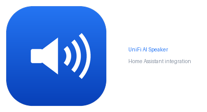

<p align="center">
  
</p>

# UniFi AI Speaker (Home Assistant custom integration)

Speaker-only control of the **UniFi AI Speaker / AI Horn Speaker** through the
local **UniFi Protect Integration API**, plus a reliable "go silent on disarm"
mechanism for use with Alarmo.

> This integration is a deliberate, standalone **companion** to Home Assistant's
> official **UniFi Protect** integration. It does **not** replace, fork, modify,
> or duplicate it, and it creates **no** cameras, doorbells, NVR, or Protect
> sensors — only one device per AI Speaker. Run both at the same time.

---

## Why this exists

The official UniFi Protect integration does not expose the AI Speaker with the
controls needed to **silence an Alarm Manager alarm when you disarm**. This
integration talks directly to the Protect Integration API to give you speaker
volume/mic controls and a safe disarm-mute workflow.

### The problem it solves

When Alarmo is disarmed, UniFi Alarm Manager keeps playing the alarm audio
(~1 minute clip, repeated 5× ≈ 5 minutes). This integration makes the speaker
**silent immediately** on disarm and then restores the exact previous volume.

### Why muting (and not "stop playback")

The current UniFi Protect Integration API (verified against the official
OpenAPI spec, v7.3.70) has **no endpoint to stop active Alarm Manager audio on a
speaker**. Speaker endpoints are read/patch/test-sound only. `play`/`stop` exist
only for the separate wireless **siren** device (`modelKey: "siren"`), *not* the
AI Horn Speaker (`modelKey: "speaker"`). So the supported approach is:

```
Disarm → save current volume → set volume 0 (instant silence)
       → wait (default 10 min) → restore the exact saved volume
```

The 10-minute default comfortably outlasts the ~5-minute repeated clip. It is
configurable in the integration options.

---

## Installation

### HACS (custom repository)
1. HACS → ⋮ → **Custom repositories**.
2. Add this repository, category **Integration**.
3. Install **UniFi AI Speaker**, then restart Home Assistant.

### Manual
Copy `custom_components/unifi_ai_speaker/` into your HA `config/custom_components/`
directory and restart Home Assistant.

---

## Create a UniFi Protect API key

1. Open your Protect console (e.g. `https://10.1.0.29`).
2. **Settings → Control Plane → Integrations** (UniFi Protect 5.3+).
3. Create an **API Key** and copy it.

The key authenticates via the `X-API-Key` header. **Keep it secret** — this
integration never logs it, never exposes it as an attribute, and redacts it from
diagnostics.

---

## Set up the integration

**Settings → Devices & Services → Add Integration → UniFi AI Speaker**

| Field | Example | Notes |
|---|---|---|
| Host / Console IP | `10.1.0.29` | Scheme/path added automatically. |
| API key | *(your key)* | Stored encrypted in the config entry. |
| Verify SSL certificate | **off** | Protect uses a self-signed cert on the LAN. Off skips TLS verification **for this console only** (via a dedicated no-verify aiohttp session). Turn it on only if your console presents a trusted certificate. |

The setup tests the connection, authenticates against `/meta/info`, and
discovers your speaker(s). Clear errors are shown for bad auth, an unreachable
console, or no speakers found. Multiple AI Speakers are all supported.

### Options (⚙ on the integration)
- **Alarm mute restore delay** — seconds before restoring volume (default `600`).
- **Alarm panel to monitor** *(optional)* — see *Re-trigger safety* below.

---

## Entities (one device per speaker)

| Entity | Type | Notes |
|---|---|---|
| Volume | number (0–100) | `PATCH volume` |
| Microphone volume | number (0–100) | only if the speaker has a mic |
| Microphone | switch | only if the speaker has a mic |
| Status | sensor (enum) | idle / streaming / playing / playing speech / uploading |
| Connection | sensor (enum, diagnostic) | connected / connecting / disconnected |
| Mode | sensor (enum, diagnostic, off by default) | listen / talk |
| Alarm mute active | binary sensor (diagnostic) | on while muted; attributes show saved volume + restore time |
| Test sound | button | `POST test-sound` |

Static details (model, MAC) live on the **device**, not as entities.

> **API limitation:** the Integration API's speaker object does **not** expose
> IP address, firmware version, or last-seen, so those diagnostic entities are
> intentionally not created.

---

## Services / actions

All target UniFi AI Speaker entities or devices.

| Service | What it does |
|---|---|
| `unifi_ai_speaker.mute_for_alarm_disarm` | Save current volume → set 0 → schedule restore (optional `restore_delay`). |
| `unifi_ai_speaker.restore_alarm_volume` | Restore the saved volume now and clear the mute. |
| `unifi_ai_speaker.cancel_alarm_mute` | Cancel the pending restore and restore immediately (use on re-arm/re-trigger). |

---

## Alarmo setup

Your existing alarm **trigger** stays exactly as-is. Alarmo keeps calling your
working `rest_command.unifi_alarm` (the Protect Alarm Manager webhook). This
integration only adds the **disarm → silence** half.

### Alarmo — Triggered action (unchanged)
```yaml
service: rest_command.unifi_alarm
```

### Alarmo — Disarmed action (new)
In Alarmo's action editor, on the **Disarmed** event:
```yaml
service: unifi_ai_speaker.mute_for_alarm_disarm
target:
  entity_id: number.garage_ai_speaker_volume   # any entity of the speaker
```
Optionally override the delay:
```yaml
service: unifi_ai_speaker.mute_for_alarm_disarm
data:
  restore_delay: 600
target:
  entity_id: number.garage_ai_speaker_volume
```

> Alarmo's editor uses the `service:` key (older style). Newer Home Assistant
> automations use `action:` instead — both map to the same call:
> ```yaml
> action: unifi_ai_speaker.mute_for_alarm_disarm
> target:
>   entity_id: number.garage_ai_speaker_volume
> ```

### Re-trigger safety (strongly recommended)

If the alarm fires again *during* the 10-minute mute window, the speaker must not
stay muted. Two equivalent options:

**A. Loosely coupled (recommended):** add a second Alarmo action on the
**Armed/Triggered** events:
```yaml
service: unifi_ai_speaker.cancel_alarm_mute
target:
  entity_id: number.garage_ai_speaker_volume
```

**B. Zero extra wiring:** set **Alarm panel to monitor** in the integration
options to `alarm_control_panel.alarmo`. Any mute is then cancelled automatically
whenever the panel leaves the disarmed state. This is the only optional,
opt-in coupling to Alarmo; left empty the integration stays fully decoupled.

---

## How the 10-minute restore works

1. On disarm, the service reads the speaker's **current** volume (e.g. `63`).
2. It saves `63` as the original volume and PATCHes volume to `0` → instant silence.
3. It schedules a one-shot restore `restore_delay` seconds later (default 600).
4. When the timer fires, it PATCHes the volume back to `63`.

State (`original_volume` + absolute `restore_deadline`) is persisted to Home
Assistant storage, so a restart mid-mute does **not** leave the speaker stuck at
0 (see *Restart behaviour*).

## How re-trigger protection works

- A **second disarm** while already muted **never** overwrites the saved volume
  with the current `0`; it keeps the first saved value and only re-extends the
  restore deadline.
- `cancel_alarm_mute` (or the optional panel monitor) **cancels the pending
  timer** and restores the real volume **immediately**, so a new alarm is
  audible. The old timer is cancelled and can never later touch the volume.

## Restart behaviour

On startup the integration reloads any saved mute:
- **Deadline already passed** → restore the saved volume immediately.
- **Deadline still in the future** → re-schedule the restore for the remaining time.

If the console/speaker is briefly unreachable at restore time, the restore is
retried (every 60s) and the saved state is kept until it succeeds.

---

## Troubleshooting

| Symptom | Check |
|---|---|
| `cannot_connect` at setup | Host reachable? Integration API enabled in Protect? Correct console IP? |
| `invalid_auth` | Regenerate the API key; ensure it has access. The integration offers re-auth. |
| `no_speakers` | The console reports no `speaker` devices; confirm the AI Speaker is adopted. |
| Volume didn't restore | Check the **Alarm mute active** binary sensor's `restore_at` attribute and the HA log lines (`Temporarily muted…` / `Restored…`). |
| Speaker shows unavailable | Speaker `state` is not `CONNECTED`; it will recover when reconnected. |

---

## Security notes

- The API key is stored in the config entry and sent only as the `X-API-Key`
  header to your local console. It is **never** logged, exposed as an attribute,
  put in exceptions, or placed in diagnostics (diagnostics are redacted).
- TLS verification is disabled **only** when you choose *Verify SSL = off*, and
  only for this console's dedicated aiohttp session — global verification is
  never disabled.
- All communication is **local**; there is no cloud dependency, and no shell or
  subprocess usage.
- Your existing `rest_command.unifi_alarm` (and `unifi_alarm_disarm`) are **not**
  touched, renamed, or migrated.

---

## Verified UniFi Protect Integration API endpoints used

Base: `https://<console>/proxy/protect/integration/v1`

| Method | Path | Use |
|---|---|---|
| GET | `/meta/info` | validate auth / console version |
| GET | `/speakers` | discovery |
| GET | `/speakers/{id}` | refresh / read current volume |
| PATCH | `/speakers/{id}` | set `volume`, `micVolume`, `isMicEnabled`, `name` |
| POST | `/speakers/{id}/test-sound` | test sound (optional `volume`) |

**Not used / not available:** there is no speaker stop-playback endpoint and no
Alarm-Manager "is running / stop" endpoint in the current API; the alarm trigger
webhook (`POST /alarm-manager/webhook/{id}`) is handled by your existing
`rest_command`, not by this integration.

---

## Logo / Home Assistant brands

Brand assets live in [`brands/`](brands/): `logo.svg` (source), `icon.png`
(256×256), `icon@2x.png` (512×512), `logo.png` / `logo@2x.png`, and
`logo-wide.png` (README lockup).

Home Assistant and HACS only render an integration's logo when the images are
present in the [`home-assistant/brands`](https://github.com/home-assistant/brands)
repository, keyed by the integration domain. To make the logo appear in the HA
UI, open a PR adding these files there:

```
custom_integrations/unifi_ai_speaker/icon.png      (256x256)
custom_integrations/unifi_ai_speaker/icon@2x.png   (512x512)
custom_integrations/unifi_ai_speaker/logo.png      (optional)
custom_integrations/unifi_ai_speaker/logo@2x.png   (optional)
```

Until that PR is merged, the integration still works — it just shows the default
Home Assistant icon.
